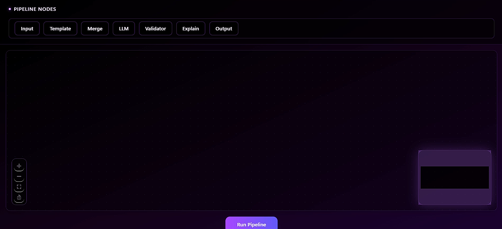
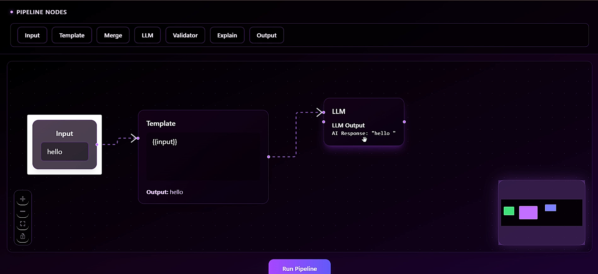

# FlowForge (Visual AI Workflow Builder)

FlowForge is a visual AI workflow builder that allows users to design, execute, and validate data pipelines by connecting modular nodes in a graph-based interface. It demonstrates how modern AI orchestration tools compose and execute workflows without requiring users to write code.

---

## Features

- Drag-and-drop, node-based workflow editor
- Modular nodes for:
  - Input handling
  - Prompt templating
  - AI response simulation
  - Data merging
  - Output visualization
- Real-time pipeline execution with visible data flow
- Custom pipeline execution engine
- DAG validation and cycle detection
- Human-readable pipeline explanations
- VectorShift-inspired dark UI

---

## Screenshots

### Workflow Builder Interface


### Live Pipeline Execution


### Output & Validation


---

## How It Works

1. Users drag nodes from the toolbar onto the canvas.
2. Nodes are connected to form a directed graph (pipeline).
3. Data flows from input nodes through transformation and AI nodes.
4. A custom execution engine resolves dependencies and executes nodes in order.
5. Outputs update live as the pipeline runs.
6. The pipeline structure can be validated and explained in natural language.

---

## Tech Stack

- **React** – Frontend framework
- **React Flow** – Graph-based UI
- **Zustand** – State management
- **Tailwind CSS** – Styling
- **FastAPI** (optional backend) – Pipeline validation

---

## Instructions to Run the Project

## Start the frontend development server:

- npm install
- npm start

Open the application in your browser:

- http://localhost:3000

## For Backend 

- If using the FastAPI backend:

- uvicorn main:app --reload

- Backend runs at:

- http://localhost:8000

### Prerequisites
- Node.js (v18 or later)
- npm

Verify installation:
```bash
node -v
npm -v
